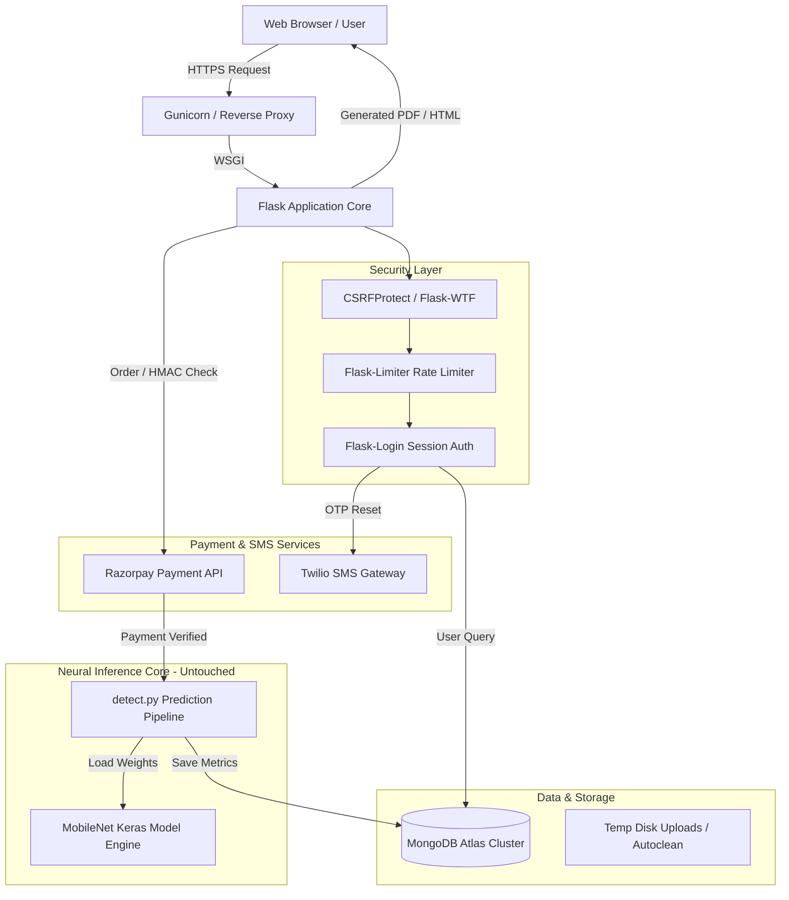
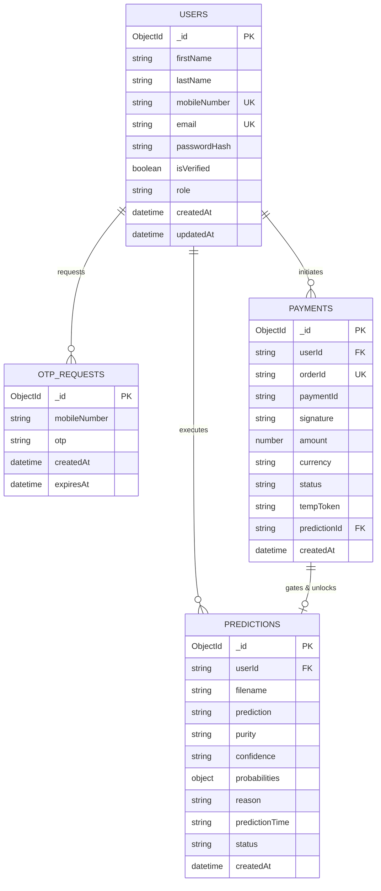
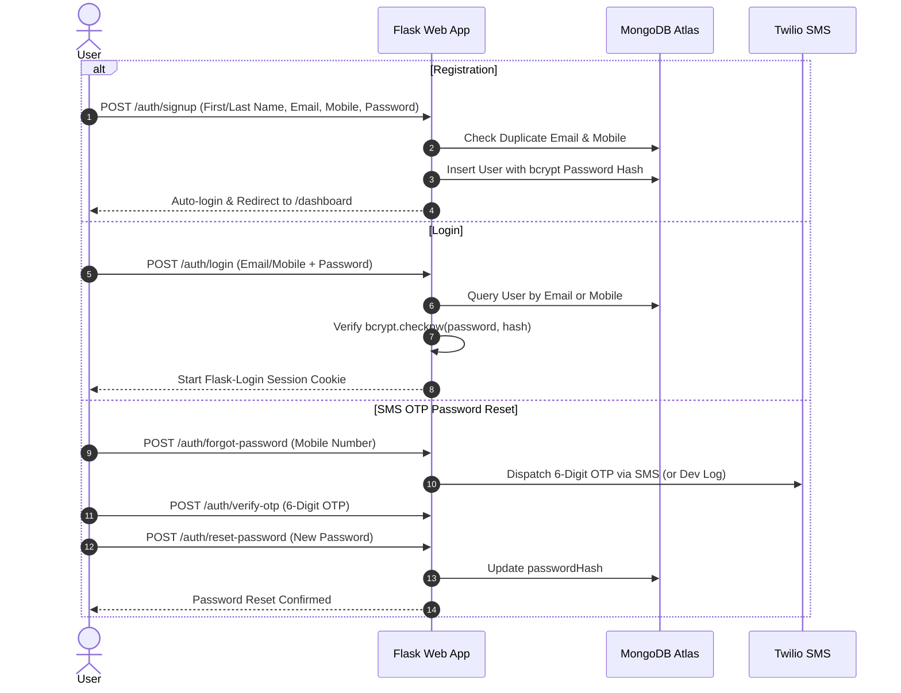
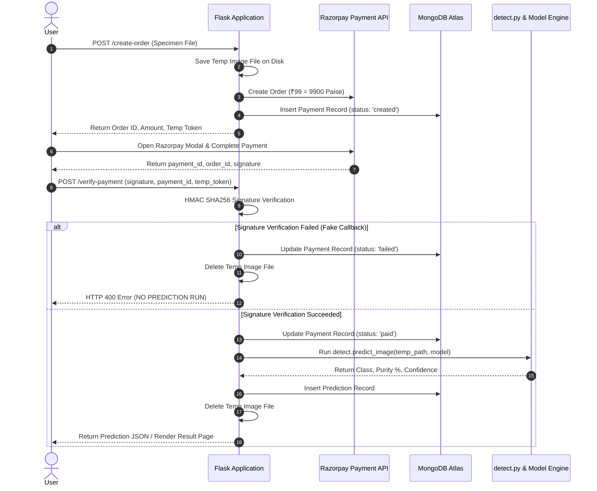
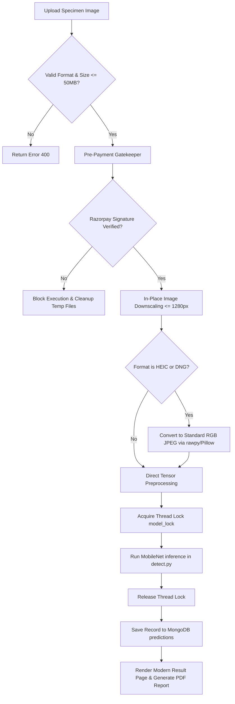

# Genetic Purity AI - Production Web Application

[](https://www.python.org/)
[](https://flask.palletsprojects.com/)
[](https://www.mongodb.com/cloud/atlas)
[](LICENSE)

An enterprise-grade production web application converting crop specimen imagery into real-time plant genetic purity diagnostics. Powered by a high-performance **MobileNet deep transfer learning architecture**, **MongoDB Atlas**, **Flask-Login**, **Razorpay Payment Gateway**, and **Twilio SMS OTP**.

---

## 1. System Architecture Diagram



---

## 2. Database Entity Diagram (MongoDB Collections)



---

## 3. Authentication Flow



---

## 4. Payment Flow (Razorpay Standard Checkout)



---

## 5. Prediction Flow



---

## 6. Railway Deployment Guide

### Option A: Deploying to Railway.app

1. **Push Code to GitHub**:
   ```bash
   git add .
   git commit -m "Deploy production Genetic Purity AI web app"
   git push origin main
   ```

2. **Connect GitHub Repo in Railway**:
   - Log in to [Railway.app](https://railway.app/).
   - Click **New Project** $\rightarrow$ **Deploy from GitHub repo**.
   - Select your repository.

3. **Configure Environment Variables in Railway**:
   Navigate to **Variables** tab and set:
   ```env
   SECRET_KEY=your_production_secret_key_here
   MONGO_URI=mongodb+srv://<username>:<password>@cluster0.xxx.mongodb.net/?retryWrites=true&w=majority
   DB_NAME=genetic_purity_db
   RAZORPAY_KEY_ID=rzp_live_XXXXXXXXXXXXXX
   RAZORPAY_KEY_SECRET=XXXXXXXXXXXXXXXXXXXX
   ANALYSIS_PRICE_INR=99
   FLASK_ENV=production
   ```

4. **Verify Deployment**:
   Railway automatically detects `Procfile` and runs:
   ```bash
   gunicorn -c gunicorn.conf.py app:app
   ```

---

## 7. Environment Variables Reference

| Variable Name | Description | Default / Example |
|---|---|---|
| `SECRET_KEY` | Flask session & CSRF signing key | `dev-genetic-purity-secret-key-2026` |
| `MONGO_URI` | MongoDB Atlas connection string | `mongodb+srv://<username>:<password>@cluster0.xxx.mongodb.net/?retryWrites=true&w=majority` |
| `DB_NAME` | Target database name | `genetic_purity_db` |
| `TWILIO_ACCOUNT_SID` | Twilio SMS Account SID | `AC...` (Console log fallback if blank) |
| `TWILIO_AUTH_TOKEN` | Twilio SMS Auth Token | `auth_token_string` |
| `TWILIO_PHONE_NUMBER` | Twilio Sender Phone Number | `+1234567890` |
| `RAZORPAY_KEY_ID` | Razorpay API Key ID | `rzp_test_sampleKeyId` |
| `RAZORPAY_KEY_SECRET` | Razorpay API Key Secret | `sampleKeySecret` |
| `ANALYSIS_PRICE_INR` | Price charged per test (INR) | `99` |

---

## 8. Local Setup & Execution

### Step 1: Clone Repository & Create Virtual Environment
```bash
git clone https://github.com/your-org/genetic-purity-ai.git
cd genetic-purity-ai
python -m venv venv
# On Windows:
venv\Scripts\activate
# On Linux/macOS:
source venv/bin/activate
```

### Step 2: Install Dependencies
```bash
pip install -r requirements.txt
```

### Step 3: Configure Environment Variables
Copy `.env.example` to `.env` and configure your database URI:
```bash
cp .env.example .env
```

### Step 4: Launch Web Server
```bash
python app.py
```

Access the application in your browser at `http://127.0.0.1:5000/`.
